## 前言  
为了加快编译速度，在工程拆分后，将一些常用库进行二进制化，工程引用库后不需要对源码进行编译。  
本文内容适合工程需要二进制化并使用过CocoaPods的朋友，工程的依赖管理可以查看这篇：[谈谈iOS多工程依赖](https://imfong.com/post/Talk-iOS-Project-Practices)  

## 方案  
发现总结的方案有以下几种  
  
1. 分仓库管理  
2. `podspec`宏管理  
3. `prepare_command` + `Carthage/cocoapods packager/python/ruby` 
4. 改版方案

### 分仓库管理  

创建了一个公用SDK仓库，专门放生成的Framework，spec文件内使用subspecs区分各个Framework。    

#### 公用SDK仓库目录结构  
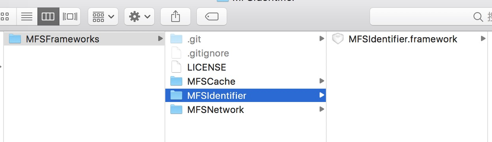

#### 公用SDK仓库spec统一管理  

```
{
  "name": "MFSFrameworks",
  "version": "x.x.x",
  "summary": "MFSFrameworks Test",
  "description": "所有使用到的SDK集合, subspecs内容纯属模拟",
  "homepage": "http://imfong.com",
  "license": "MIT",
  "authors": {
    "maxfong": "devmaxfong@qq.com"
  },
  "platforms": {
    "ios": "6.0"
  },
  "source": {
    "git": "git仓库地址",
    "tag": "x.x.x"
  },
  "libraries": "xml2",
  "requires_arc": true,
  "subspecs": [
    {
      "name": "MFSCache",
      "resources": "MFSCache/*.bundle",
      "vendored_frameworks": "MFSCache/*.framework",
      "vendored_libraries": "MFSCache/*.a",
      "frameworks": "SystemConfiguration"
    },
    {
      "name": "MFSNetwork",
      "source_files": "MFSNetwork/*.{h,m}",
      "vendored_frameworks": "MFSNetwork/*.framework",
      "frameworks": [
        "AVFoundation"
      ],
      "libraries": [
        "z",
        "c++"
      ]
    },
    {
      "name": "MFSIdentifier",
      "source_files": "MFSIdentifier/**/*.{h}",
      "vendored_frameworks": "MFSIdentifier/*.framework",
      "frameworks": [
        "AdSupport"
      ],
      "dependencies": {
        "MFSCache": [
        ]
      }
    }
  ]
}
```

#### 使用方式

```
pod 'MFSFrameworks', 'x.x.x',
    :subspecs => ['MFSNetwork', 'MFSCache', 'MFSIdentifier']
```
假设`MFSIdentifier`需要源码调试，podfile修改为  

```
pod 'MFSFrameworks', 'x.x.x',
    :subspecs => ['MFSNetwork', 'MFSCache']
pod 'MFSIdentifier', 'x.x.x'
```

#### 缺点  
1. 需要额外维护一个公用SDK仓库
2. 维护2个spec，源码仓库也需要升级
3. 每次功能改动，需要打包并提交到公用SDK仓库

### `podspec`宏管理 

比对上一种方案，不需要创建公用SDK仓库，只需要维护源码仓库，将生成的Framework直接提交在源码仓库。  
使用`MFSIdentifier`举例  

#### podspec  

使用`pod lib create MFSIdentifier`创建工程，会自动生成`MFSIdentifier.podspec`  
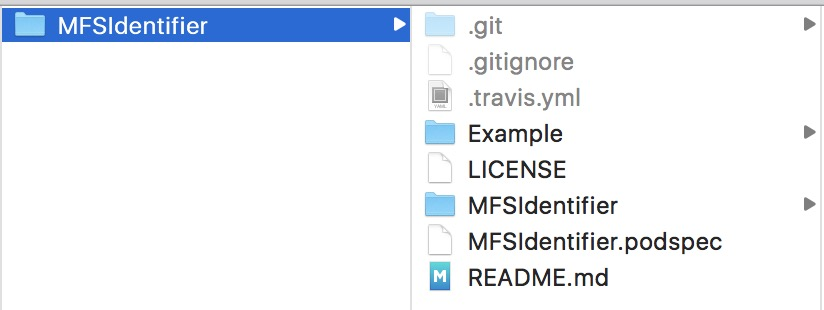

>可使用命令转换成json文件  
>pod ipc spec MFSIdentifier.podspec >> MFSIdentifier.podspec.json  

`podspec`内是支持if、else语法的  

```
Pod::Spec.new do |s|
  s.name             = 'MFSIdentifier'
  s.version          = '1.0.0'
  s.summary          = 'iOS App DeviceId'
  s.description      = <<-DESC
  iOS App唯一标识符获取方案
                       DESC

  s.homepage         = 'https://github.com/maxfong/MFSIdentifier'
  
  s.license          = { :type => 'MIT', :file => 'LICENSE' }
  s.author           = { 'maxfong' => 'devmaxfong@qq.com' }
  s.source           = { :git => 'https://github.com/maxfong/MFSIdentifier.git', :tag => s.version.to_s }
  s.ios.deployment_target = '8.0'

  if ENV['IS_SOURCE']
    s.source_files = [
      'MFSIdentifier/*.{h,m}',
      'MFSIdentifier/**/*.{h,m}'
    ]
  else
    s.source_files = 'SDK/**/*.{h}'
    s.ios.vendored_frameworks = 'SDK/*.framework'
  end
  
  s.dependency 'MFSCache'
  s.xcconfig = {
    'OTHER_LDFLAGS' => '-ObjC'
  }
end

```

#### 仓库目录  
提前将二进制文件编译好放在工程仓库的SDK目录内  
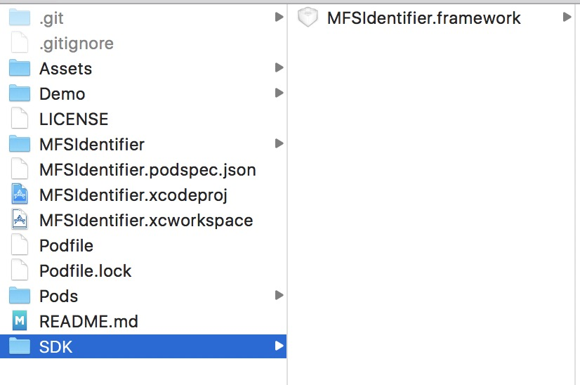

#### 使用方式  

正常使用  

```
pod install
```

源码调试  

```
IS_SOURCE=1 pod install
```

#### 缺点
1. 只支持私有源库，共有库提交后会变成`podspec.json`，不再支持if判断
2. 每次修改代码需打包新Framework，可能遗漏
3. 调试模式和正常使用切换需要清理Pod缓存

<span id = "clean"></span>
#### 清理缓存

1. 命令`pod cache clean MFSIdentifier`或删除`/Users/[用户名]/Library/Caches/CocoaPods/Pods/Release/MFSIdentifier`目录  
2. 移除工程中`Pods/MFSIdentifier`文件夹  

参考[CocoaPods组件平滑二进制化解决方案](http://mdsb100-xiabigao.daoapp.io/ios-cocoapodszu-jian-ping-hua-er-jin-zhi-hua-fang-an-ji-xiang-xi-jiao-cheng/)   

### `prepare_command` + `Carthage/cocoapods packager/python/ruby`   

#### Carthage  
Carthage是一款去中心化的依赖管理器，只需要工程配置好，即可编译

```
//github
github "maxfong/MFSIdentifier" >= 1.0.0
//自定义git仓库
git "https://github.com/maxfong/MFSIdentifier.git"  >= 1.0.0  
//本地目录
carthage build --no-skip-current
```  

配置Carthage时需选择Manager Schemes并对需要编译的Target勾选Shared，否则会出现提示    
`Dependency "项目名" has no shared framework schemes`
> 是因为Carthage编译基于xcodebuild，-workspace编译时需要-scheme参数  
> 而我们配置`.gitignore`中排除了`xcuserdata`  
> git下载的工程(或删掉`xcuserdata`)后运行`xcodebuild -list`可以发现不存在`Schemes`一项  
> 勾选Shared后会在`.xcodeproj`创建xcshareddata目录，里面保存着`.xcscheme`  

##### 局限性    
1. 打成的动态Framework需要添加到工程`Embeddd Binaries`中，打包后的app内包含framework文件，影响包大小。  
2. 使用Carthage生成的Framework，包含完整的类实现，如果依赖库过多影响整体包大小。  

>区分架构打包后需要通过脚本控制设备和模拟器的库引用比较麻烦  

[Carthage](https://github.com/Carthage/Carthage)  
[Carthage的使用](https://www.baidu.com/s?wd=Carthage%E7%9A%84%E4%BD%BF%E7%94%A8)  

#### cocoapods packager  

```
安装  
sudo gem install cocoapods-packager  
```

##### 局限性  
不用的原因同Carthage，依赖过多会引起类冲突  

[cocoapods-packager](https://github.com/CocoaPods/cocoapods-packager)  
[cocoapods打包](https://www.baidu.com/s?wd=cocoapods%20packager)  

>开源项目将podspec文件也放在仓库中，是为了支持cocoapods packager  

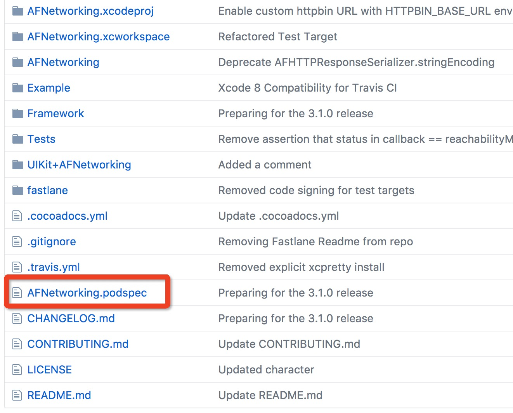  

<span id = "shell"></span>
#### Shell  

工程原来使用的编译脚本就是shell，正好可以使用起来  

```
# 更新CocoaPods
#pod update

# 填写Framework的Target名称
FMK_NAME=Target名称
WORKSPACE_NAME=${FMK_NAME}
SCHEME_NAME=${FMK_NAME}
# Install dir will be the final output to the framework.
# The following line create it in the root folder of the current project.
INSTALL_DIR=Products/${FMK_NAME}.framework
# Working dir will be deleted after the framework creation.
WRK_DIR=build
DEVICE_DIR=${WRK_DIR}/Release-iphoneos/${FMK_NAME}.framework
SIMULATOR_DIR=${WRK_DIR}/Release-iphonesimulator/${FMK_NAME}.framework
# project方式
# xcodebuild -configuration "Release" -target "${FMK_NAME}" -sdk iphoneos clean build
# xcodebuild -configuration "Release" -target "${FMK_NAME}" -sdk iphonesimulator clean build
# workspace方式
xcodebuild -workspace ${WORKSPACE_NAME}".xcworkspace" -configuration "Release" -scheme ${SCHEME_NAME} SYMROOT=$(PWD)/build -sdk iphoneos clean build
xcodebuild -workspace ${WORKSPACE_NAME}".xcworkspace" -configuration "Release" -scheme ${SCHEME_NAME} SYMROOT=$(PWD)/build -sdk iphonesimulator clean build
# Cleaning the oldest.
if [ -d "${INSTALL_DIR}" ]
then
rm -rf "${INSTALL_DIR}"
fi
mkdir -p "${INSTALL_DIR}"
cp -R "${DEVICE_DIR}/" "${INSTALL_DIR}/"
# Uses the Lipo Tool to merge both binary files (i386 + armv6/armv7) into one Universal final product.
lipo -create "${DEVICE_DIR}/${FMK_NAME}" "${SIMULATOR_DIR}/${FMK_NAME}" -output "${INSTALL_DIR}/${FMK_NAME}"
rm -r "${WRK_DIR}"

```   

>使用这段脚本打出的Framework，不包含引用类，多个framework需相互依赖才可使用。  

#### prepare_command  

通过`prepare_command `使Pod支持`bash script`。  
[CocoaPods prepare_command](https://guides.cocoapods.org/syntax/podspec.html#prepare_command)  

使得我们提前执行设定的script，podspec文件改为：  

```
{
  "name": "MFSIdentifier",
  "version": "1.0.0",
  "summary": "iOS App DeviceId",
  "description": "iOS App唯一标识符获取方案",
  "homepage": "https://github.com/maxfong/MFSIdentifier",
  "license": "MIT",
  "authors": {
    "maxfong": "devmaxfong@qq.com"
  },
  "platforms": {
    "ios": "8.0"
  },
  "source": {
    "git": "https://github.com/maxfong/MFSIdentifier.git",
    "tag": "1.0.0"
  },
  "dependencies": {
    "MFSCache": [ ]
  },
  "xcconfig" : {
    "OTHER_LDFLAGS" : "-ObjC"
  },
  "vendored_frameworks": "设定好的编译目录/*.framework",
  "prepare_command": "/usr/bin/python build_framework.py"
  //或
  // "prepare_command": "/usr/bin/ruby build_framework.rb"
  //或
  // "prepare_command": "/bin/sh pod package MFSIdentifier.podspec.json"
  //或
  // "prepare_command": "/bin/sh carthage build --no-skip-current"
}
```

寻一款熟悉的语言，工程目录内添加对应的脚本文件  

[I have a pod, I have a carthage, En...](http://mp.weixin.qq.com/s/wV68OWGB3fiWc1hJW-o59g)   


### 完整的流程  

#### 工程创建   

创建Cocoa Touch Framework，命名为`iOSBinaryPractice`  
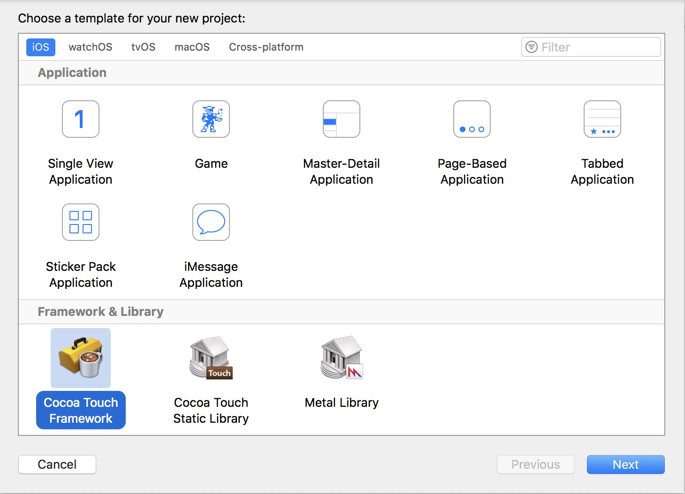  

开启Shared
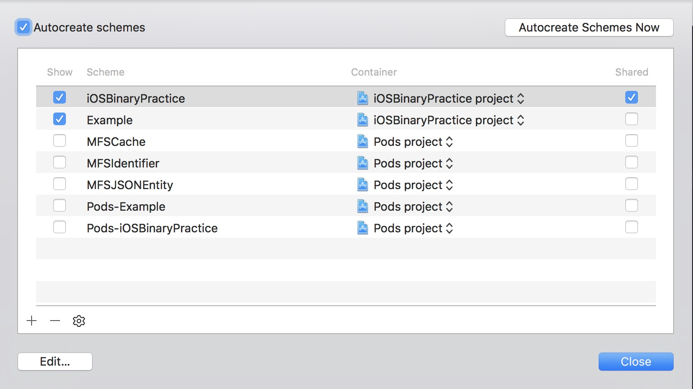  


设置`Mach-O`为`Static Library`，如果工程支持动态库，则不需要修改  
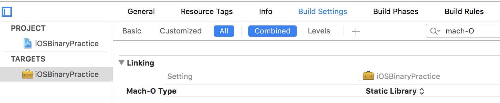

添加`Podfile`并`pod update`  
>这步是模拟支持依赖其他库，可以不需要

```
source 'https://github.com/CocoaPods/Specs.git'

target 'iOSBinaryPractice' do
	pod 'MFSIdentifier'
end
```

添加功能类，引用依赖`MFSIdentifier`  
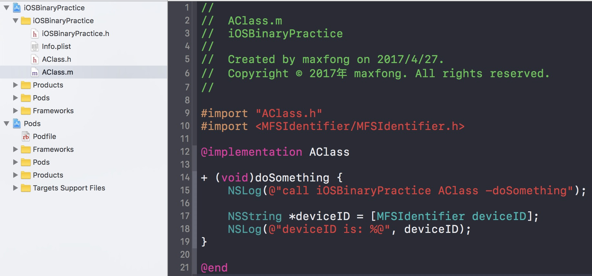  

创建`Example`引用`iOSBinaryPractice.framework`  
>这步是测试`iOSBinaryPractice.framework`能否正常使用  
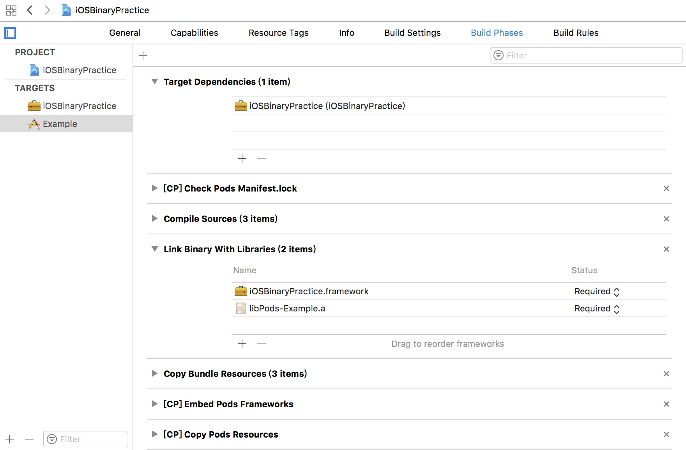  

更新`Podfile`  

```
source 'https://github.com/CocoaPods/Specs.git'

target 'iOSBinaryPractice' do
	pod 'MFSIdentifier'
end

target 'Example' do
    pod 'MFSIdentifier'
end
```

在`Example`调用，发现运行一切正常
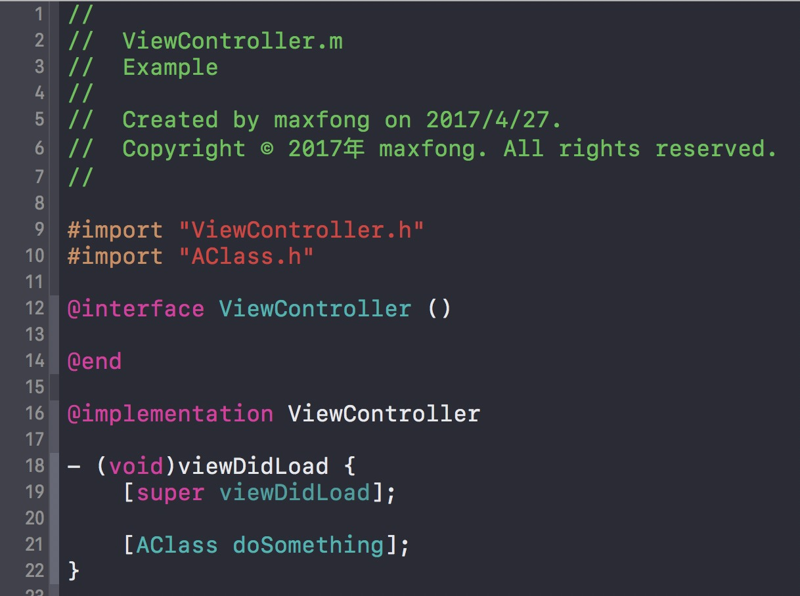  

#### Shell创建   
工程目录创建`build_framework.sh`，内容为之前[shell](#shell)脚本    

>如果仓库只要pod依赖，需要开启`#pod update`  
>FMK_NAME=Target名称需要修改，直接使用${PROJECT_NAME}会有问题  
>终端打开工程目录，执行`sh build_framework.sh`，查看是否生成了`Products`目录，并且`iOSBinaryPractice.framework`是否生成

#### podspec创建提交  

创建podspec，测试并且提交cocoapods，最终的`iOSBinaryPractice.podspec.json`文件  
>过程省略

```
{
  "name": "iOSBinaryPractice",
  "version": "1.0.0",
  "summary": "iOSBinaryPractice",
  "description": "iOS 组件二进制化方案 Demo",
  "homepage": "https://github.com/maxfong/iOS-Library-Binary-Practice",
  "license": "MIT",
  "authors": {
    "maxfong": "devmaxfong@qq.com"
  },
  "platforms": {
    "ios": "7.0"
  },
  "source": {
    "git": "https://github.com/maxfong/iOS-Library-Binary-Practice.git",
    "tag": "1.0.0"
  },
  "source_files": "Products/**/*.{h}",
  "vendored_frameworks": "Products/*.framework",
  "dependencies": {
    "MFSIdentifier": [
    ]
  },
  "prepare_command": "/bin/sh build_framework.sh"
}

```

#### 使用方式  
在`podfile`中引用  

```
pod 'iOSBinaryPractice', '1.0.0'
```
>`Installing iOSBinaryPractice 1.0.0`过程时间会长一点，是在编译  

完成后查看Pods目录文件结构  
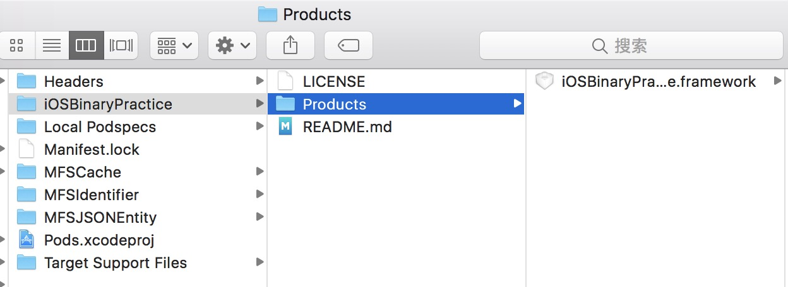  

#### 调试问题  
二进制化后的提高了工程编译速度，但是不可以调试，所以我们需要支持源码调试模式  

创建`0.1.alpha`标签，规定`0.1.alpha`为调试版本，podspec内容  
>很难命名，这边就叫`0.1.alpha`，想直接定义为`debug`标签，但是CocoaPods不允许  
>1.标签排在第一位，一般不会被使用到  
>2.很难被重复定义  

```
{
  "name": "iOSBinaryPractice",
  "version": "0.1.alpha",
  "summary": "iOSBinaryPractice",
  "description": "iOS 组件二进制化方案 Demo",
  "homepage": "https://github.com/maxfong/iOS-Library-Binary-Practice",
  "license": "MIT",
  "authors": {
    "maxfong": "devmaxfong@qq.com"
  },
  "platforms": {
    "ios": "7.0"
  },
  "source": {
    "git": "https://github.com/maxfong/iOS-Library-Binary-Practice.git",
    "tag": "0.1.alpha"
  },
  "source_files": [
    "iOSBinaryPractice/*.{h,m}"
  ],
  "dependencies": {
    "MFSIdentifier": [
    ]
  }
}
```

#### 源码模式  
在`podfile`中引用  

```
pod 'iOSBinaryPractice', '0.1.alpha'
```

>`0.1.alpha`标签类似一个指针，可以修改并指向代码的最新版本  
>如果发现源码与标签指向的不同，你可能需要做一次清理  
>参考文章之前的[清理](#clean)


### 完整的代码

[iOS-Library-Binary-Practice](https://github.com/maxfong/iOS-Library-Binary-Practice)  

### 后续  
使用这种方式将Xcode的build时间提前到了`pod update`阶段，使得开发时效率加快。  
文章的很多细节没有表达出来，如果实践有问题可以留言。  
